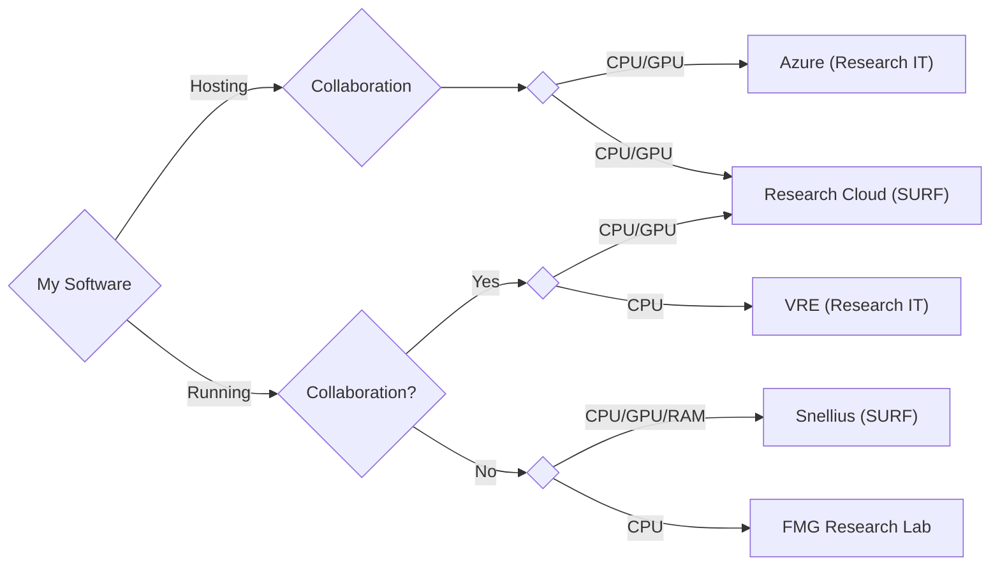

# rdm-options

```mermaid

flowchart LR

    AP{"My Software"}
    
    CL1{Collaboration}
    CL2{Collaboration?} 
    
    CP1{" "}
    CP2{" "}
    CP3{" "}

    AP -- Hosting --> CL1
    AP -- Running --> CL2
    
    CL1 --> CP3
    CP3 -- CPU/GPU --> ALZ["Azure (Research IT)"]
    CP3 -- CPU/GPU --> SRC["Research Cloud (SURF)"]

    CL2 -- Yes --> CP1
    CP1 -- CPU --> VRE["VRE (Research IT)"]
    CP1 -- CPU/GPU --> SRC

    CL2 -- No --> CP2
    CP2 -- CPU/GPU/RAM --> SNL["Snellius (SURF)"]
    CP2 -- CPU --> REB["FMG Research Lab"]

```
